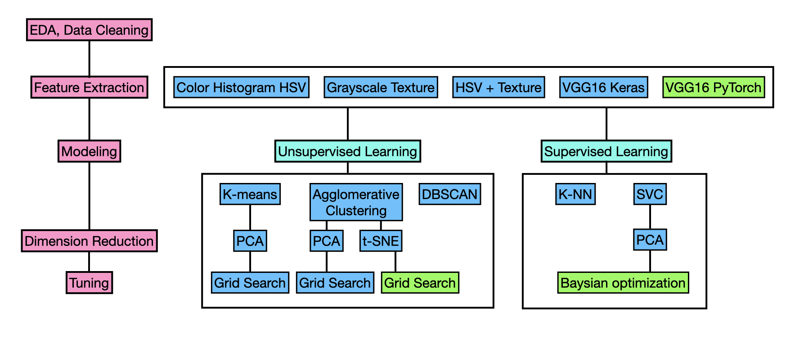

# DTSA_5510_Final_Project
---

This repository is for the DTSA 5510 Unsupervised Learning course's final project. It applies unsupervised learning methods to image recognition problems and compares them with supervised learning methods.

The data comes from the Kaggle dataset [Animals](https://www.kaggle.com/datasets/antobenedetti/animals/data), which contains about 15k pictures of animals in five categories: cats, dogs, elephants, horses, and lions. The training set consists of 13,474 images including .jpg, .jpeg, .png files, while the validation set contains 1,497 images.

This notebook covers EDA, Data Cleaning, Feature Extraction(color histogram, grayscale texture, VGG16), Dimension Reduction (using PCA and t-SNE), Modeling (with K-means, Agglomerative Clustering; and k-NN, SVM), and Tuning (Grid Search, Baysian Optimization). Metrics used include accuracy, f1 score and confusion matrix.

 

## Summary

| Feature Extraction Method              | Clustering/Classification Method | Dataset | Accuracy | F1 Score | Silhouette Score |
|----------------------------------------|----------------------------------|---------|----------|----------|------------------|
| Color Histogram HSV                    | K-means                          | Train   | 0.28100  | 0.22006  | 0.14721          |
| Grayscale Texture                      | K-means                          | Train   | 0.34564  | 0.28369  | 0.47389          |
| Color Histogram + Grayscale Texture    | K-means                          | Train   | 0.34549  | 0.28357  | 0.47378          |
| VGG16_Keras                            | K-means                          | Train   | 0.67409  | 0.62173  | 0.10764          |
| VGG16_PyTorch                          | K-means                          | Train   | 0.85696  | 0.85748  | 0.12684          |
--
| VGG16 + PCA                   | K-means                          | Train   | 0.90569  | 0.90649  | 0.52118          |
| VGG16 + PCA + Tuning          | K-means                          | Train   | 0.90643  | 0.90721  | 0.52115          |
| VGG16                          | Agglomerative Clustering         | Train   | 0.77864  | 0.76939  | 0.13374          |
| VGG16 + PCA                   | Agglomerative Clustering         | Train   | 0.88200  | 0.88277  | 0.51950          |
| VGG16 + PCA + Tuning          | Agglomerative Clustering         | Train   | 0.91660  | 0.91703  | 0.51900          |
| VGG16 + t-SNE                 | Agglomerative Clustering         | Train   | 0.87460  | 0.87588  | 0.32817          |
| `VGG16 + t-SNE + Tuning`        | `Agglomerative Clustering`         | `Train`   | `0.92758`  | `0.92745`  | 0.36202          |
--
| VGG16                          | KNN                              | Train   | 0.97018  | 0.97016  | -         |
| VGG16                         | KNN                              | Valid   | 0.96192  | 0.96210  | -         |
| VGG16                          | SVM                              | Train   | 0.98909  | 0.98910  | -         |
| VGG16                          | SVM                              | Valid   | 0.97662  | 0.97665  | -         |
| VGG16 + PCA                | SVM                              | Train   | 0.97795  | 0.97796  | -         |
| VGG16 + PCA                | SVM                              | Valid   | 0.97328  | 0.97328  | -         |
| `VGG16 + PCA + Tuning`       | `SVM`                              | `Train`   | `0.98490`  | `0.98491`  | -         |
| `VGG16 + PCA + Tuning`       | `SVM`                              | `Valid`   | `0.97328`  | `0.97331`  | -         |

The results of using different feature extraction, dimensionality reduction, and clustering methods have been organized above. Among them, the method using VGG16_PyTorch for feature extraction combined with SVC for classification achieved the highest accuracy and F1 score. This indicates that features extracted by deep learning algorithm (such as VGG16) are more effective than traditional color histogram or grayscale texture features, and that supervised learning (K-NN, SVC) performs better in this image recognition task than unsupervised learning (K-means, Agglomerative Clustering, DBSCAN).

Dimensionality reduction can decrease the dimensions of the feature space while retaining the largest variance. This not only reduces the computational burden but also reduces noise and improves the performance of clustering and classification algorithms. Prior to using unsupervised learning's k-means and agglomerative clustering for classification, dimensionality reduction using PCA and t-SNE both contributed to improved classification performance, and the increase in Silhouette score also indicates that it helps improve clustering quality. However, for supervised learning models, the benefits of dimensionality reduction were not directly reflected by the numbers at this stage, but it can help the model avoid overfitting, increase robustness, and improve generalization ability.

Appropriate parameter tuning can allow the model to better adapt to the specific characteristics of the dataset. From the results in the table, both supervised and unsupervised learning can improve model performance through tuning.

 

### Directions for Improvement

- Perform more diversified data augmentation and optimize preprocessing procedures before training to enhance the model's generalization ability on new data.

- Explore more effective methods of feature extraction.

- Try using other more advanced dimensionality reduction techniques to better maintain the local and global structure of the data.

- Conduct more detailed and comprehensive parameter tuning to find the optimal model configuration.

- Attempt to combine multiple feature extraction and classification/clustering methods, such as ensemble learning, to improve the model's stability and accuracy.
